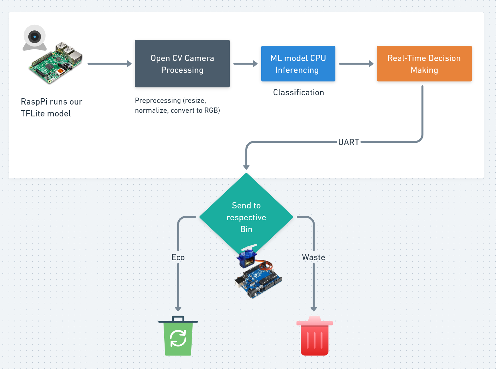

# Smart Waste Bin Sorter 🗂️♻️

An intelligent waste sorting system that uses computer vision and machine learning to automatically classify and sort electronic waste into appropriate bins. The system combines a Raspberry Pi-based image recognition system with an Arduino-controlled servo mechanism for automated sorting.

**Demo Here:** [https://youtu.be/0UpdIVTVKLA](https://youtu.be/0UpdIVTVKLA)


## Features

- **Real-time waste classification** using TensorFlow Lite model
- **Automated sorting mechanism** with servo-controlled bin selector
- **5-category waste detection**: Glass, Metal, Paper, Plastic, and General Trash
- **Visual feedback** with live camera feed and classification confidence
- **Smart center detection** - only processes objects placed in the designated area
- **Arduino integration** for precise servo control
- **Voting system** - analyzes objects over a 5-second window for accurate classification

## System Architecture




```
┌─────────────────┐    ┌─────────────────┐     ┌─────────────────┐
│   Raspberry Pi  │    │     Arduino     │     │   Servo Motor   │
│ (Classification)│◄──►│   (Control)     │◄──► │   (Sorting)     │
│                 │    │                 │     │                 │
│  • Camera Feed  │    │  • Serial Comm  │     │  • Default Position - 90° │
│  • ML Model     │    │  • Servo Driver │     │  • 35° (Recycle)│
│  • Decision     │    │  • Position Ctrl│     │  • 145° (Trash) │
└─────────────────┘    └─────────────────┘     └─────────────────┘
```

## 🛠️ Hardware Requirements

### Raspberry Pi Setup
- Raspberry Pi 4 (recommended) or Pi 3B+
- USB Camera or Pi Camera Module
- SD Card (32GB+)
- Power Supply (5V, 3A)

### Arduino Setup
- Arduino Uno/Nano
- Servo Motor (SG90 or similar)
- USB Cable for serial communication
- Jumper wires
- Breadboard (optional)

### Physical Components
- Waste collection bins (2x)
- Mounting frame for camera and servo
- Funnel or chute system

## Software Dependencies


### Arduino
- Arduino IDE
- Servo library (included with Arduino IDE)

## Installation & Setup

### 1. Raspberry Pi Configuration

1. **Clone the repository:**
   ```bash
   git clone https://github.com/yourusername/Smart-E-Waste-Bin-Sorter.git
   cd Smart-E-Waste-Bin-Sorter
   ```

2. **Install Python dependencies:**
   ```bash
   pip install opencv-python tensorflow pyserial numpy
   ```

3. **Train the model (optional):**
   - Open `TrashNet.ipynb` in Jupyter Notebook
   - Follow the notebook to train your custom model
   - Or use the provided pre-trained model


### 2. Arduino Setup

1. **Open Arduino IDE**
2. **Load `arduino_main.ino`**
3. **Connect servo to pin 9**
4. **Upload the code to Arduino**

### 3. Hardware Assembly

1. **Servo Connection:**
   ```
   Servo Wire    Arduino Pin
   Red (VCC)  →  5V
   Black (GND)→  GND
   Yellow/Orange (Signal) → Pin 9
   ```

2. **Position the servo:**
   - 35° position: Recyclable bin
   - 145° position: General trash bin
   - 90° position: Default/center position

## Usage

### Starting the System

1. **Power on Arduino and Raspberry Pi**

2. **Run the classification system:**
   ```bash
   python3 raspberry_code.py
   ```

3. **Place objects in the camera's center region** (marked by green rectangle)

4. **The system will:**
   - Analyze the object for 5 seconds
   - Classify it using the trained model
   - Send sorting command to Arduino
   - Move servo to appropriate bin position

### Operation Flow

1. **Object Detection**: Camera captures live feed
2. **ROI Analysis**: Only processes objects in center region
3. **Classification**: TensorFlow Lite model predicts waste type
4. **Voting**: Collects predictions over 5-second window
5. **Decision**: Determines most common classification
6. **Sorting**: Sends signal to Arduino (1=Recyclable, 2=Trash)
7. **Actuation**: Servo moves to appropriate bin position


## Configuration

### Key Parameters in `raspberry_code.py`:

```python
MODEL_PATH = "trashnet_model.tflite"  # Path to your model
CONF_THRESHOLD = 0.4                  # Confidence threshold
SERIAL_PORT = "/dev/ttyACM0"         # Arduino serial port
VOTE_WINDOW = 5.0                    # Seconds for averaging
CENTER_RATIO = 0.4                   # Size of detection region
```

### Arduino Servo Positions in `arduino_main.ino`:

```cpp
case 1: m_servo.write(35);   // Recyclable bin
case 2: m_servo.write(145);  // Trash bin
default: m_servo.write(90);  // Center position
```

---

**Made with ❤️ for a cleaner environment** 🌱
